# GMUI

**Immediate-mode GUI framework for GameMaker**

Native GML implementation of immediate-mode UI paradigm. No extensions. No DLLs.

---

## What is GMUI?

GMUI brings the immediate-mode GUI paradigm to GameMaker. Instead of retaining UI state between frames, you declare your UI every frame. This eliminates callback hell, simplifies dynamic interfaces, and makes UI code as straightforward as drawing primitives.

---

## Features

- **Windows** – Standalone Windows or basic Containers
- **Widgets** – Buttons, checkboxes, sliders, knobs, textboxes, combo boxes, color pickers, date pickers... (in total 70+)
- **Layout** – Columns, rows, auto layouts, indentation, docking (WINS)
- **Data** – 20+ chart types, tree views, list boxes, key-value lists
- **Interaction** – Tooltips, toast notifications, context menus, modal popups
- **Styling** – Complete theming system with live demo style editor

---

## Quick Example

```gml
if (gmui_begin("Debug", 100, 100, 290, 154)) {
	gmui_text($"Hello, world {123}");
	if (gmui_button("Save")) {
		/* Do stuff */
	}
	str = gmui_textbox_label(str, "string");
	float = gmui_slidebar_label(float, "float", 0, 1);
	gmui_end();
}
```


```gml
// Create a context menu to be used by window menu.
if (gmui_begin_context_menu("Ctx_File")) {
	if (gmui_context_menu_item("Open..", "Ctrl+O")) { /* Do stuff */ }
	if (gmui_context_menu_item("Save", "Ctrl+S")) { /* Do stuff */ }
	if (gmui_context_menu_item("Close", "Ctrl+W")) { /* Do stuff */ }
	gmui_end_context_menu();
}

// Create a window called "My First Tool", with a menu bar.
if (gmui_begin("My First Tool", 100, 100, 500, 500)) {
	gmui_window_menu(
		[
			gmui_menu_item("File", "Ctx_File")
		]
	);
	
	// Edit a color stored as RGBA
	my_color = gmui_color_edit_4(my_color, "Color");
	
	// Generate samples and plot them
	for (var i = 0; i < array_length(samples); i++) {
		samples[i] = sin(i * 0.2 + current_time / 1000 * 1.5);
	};
	gmui_plot_lines(samples, array_length(samples), undefined, 24, false);
	
	// Display contents in a scrolling region
	gmui_text_colored("Important Stuff", make_color_rgb(255, 255, 0));
	if (gmui_begin_child("Scrolling")) {
		for (var i = 0; i < 50; i++) {
			gmui_text($"{string_replace_all(string_format(i, 4, 0), " ", "0")}: Some text");
		};
		gmui_end_child();
	}
	gmui_end();
}
```


---

## Gallery

<table align="center">
  <tr>
    <td align="center">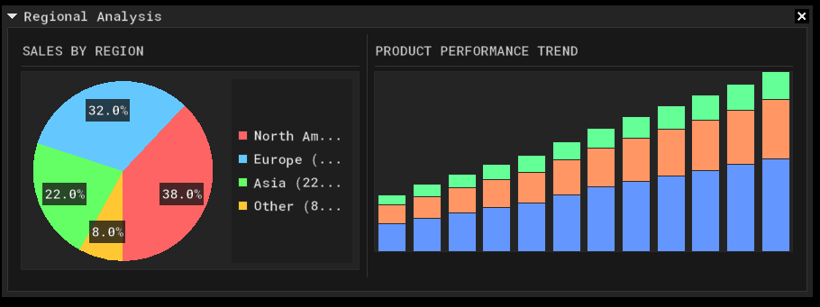</td>
    <td align="center">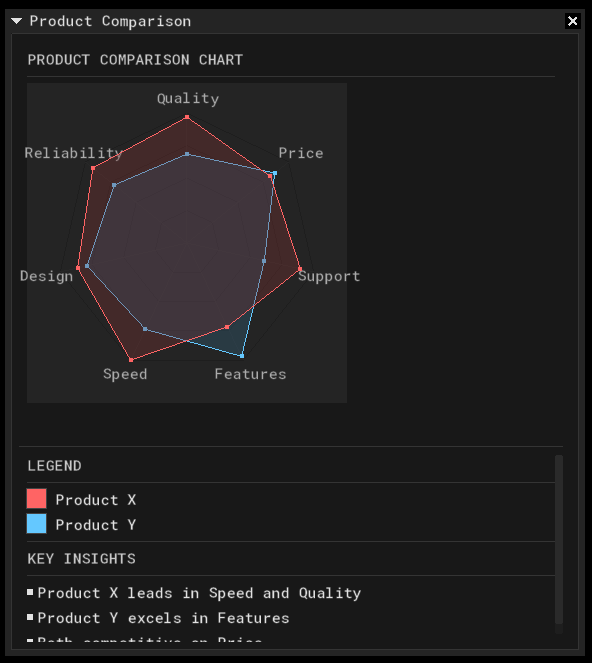</td>
    <td align="center">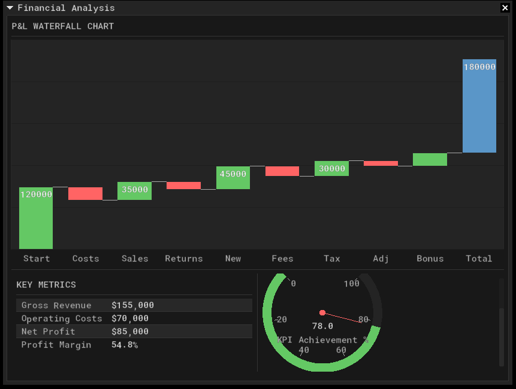</td>
  </tr>
  <tr>
    <td align="center">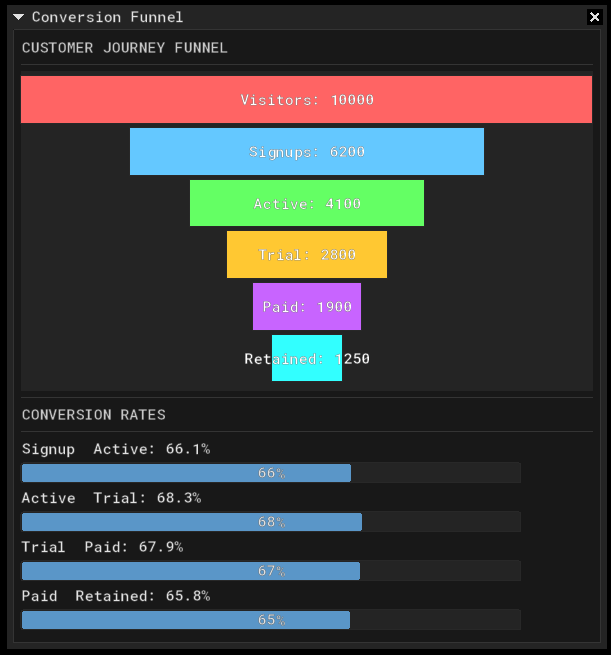</td>
    <td align="center">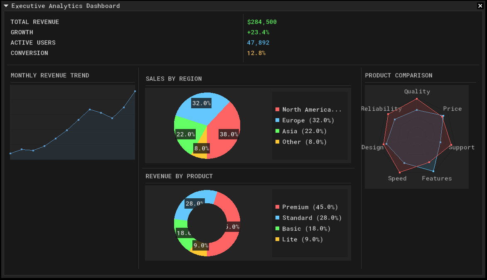</td>
    <td align="center">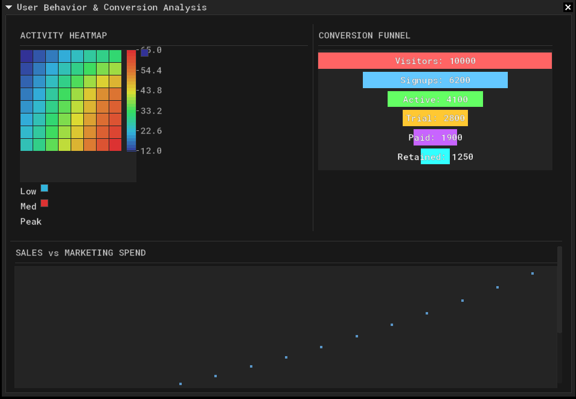</td>
  </tr>
  <tr>
    <td align="center">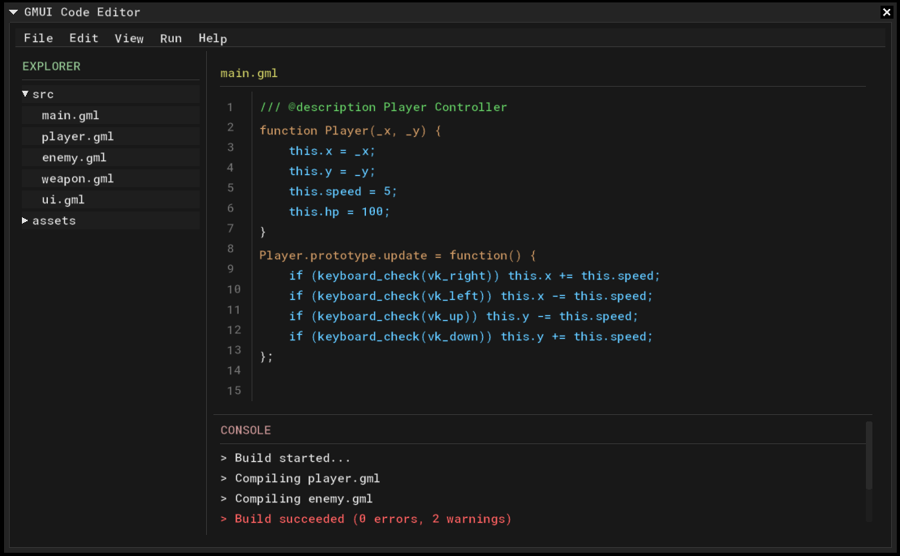</td>
    <td align="center">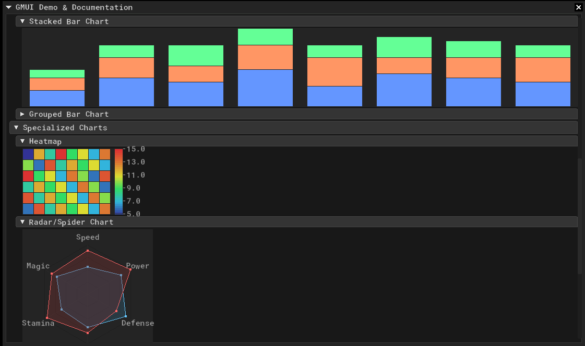</td>
    <td align="center">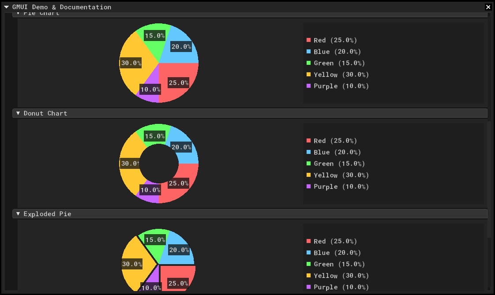</td>
  </tr>
  <tr>
    <td align="center">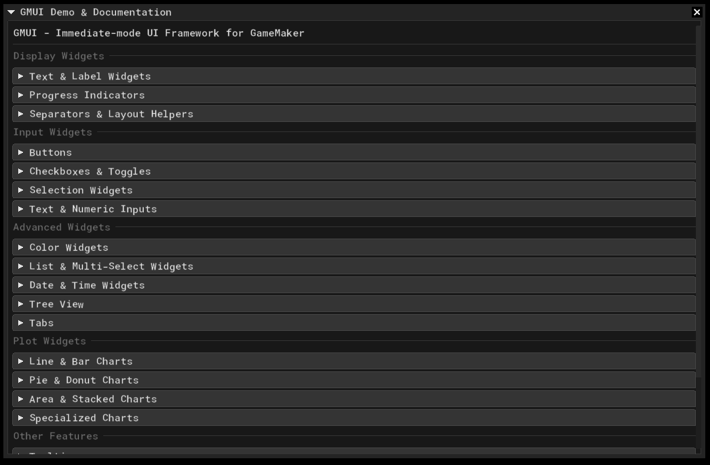</td>
    <td align="center">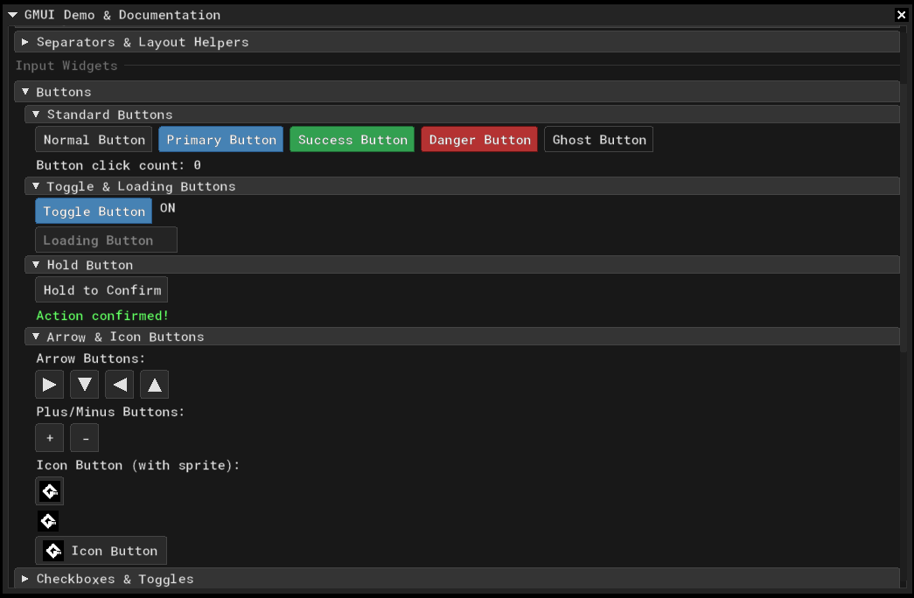</td>
    <td align="center">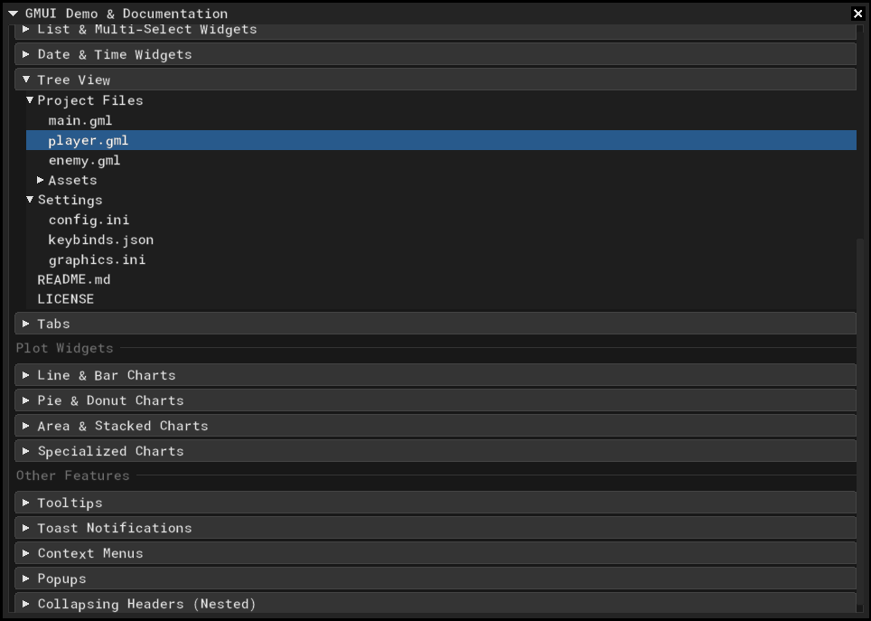</td>
  </tr>
  <tr>
    <td align="center">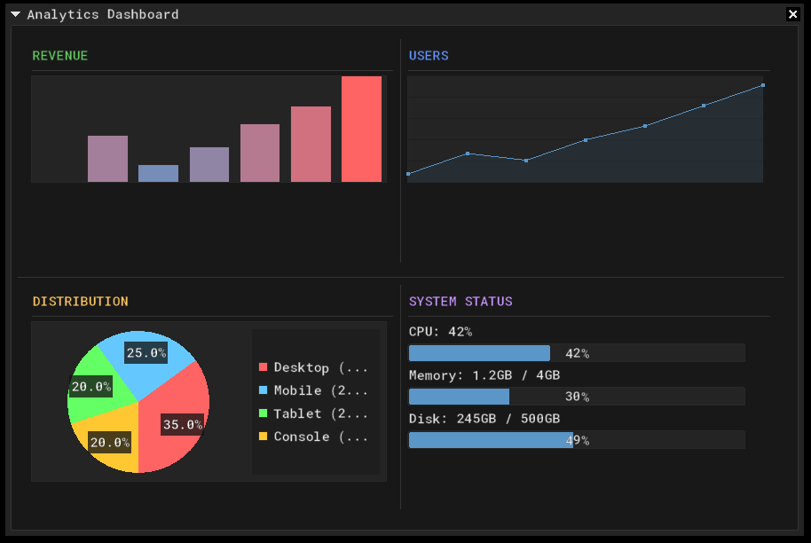</td>
    <td align="center">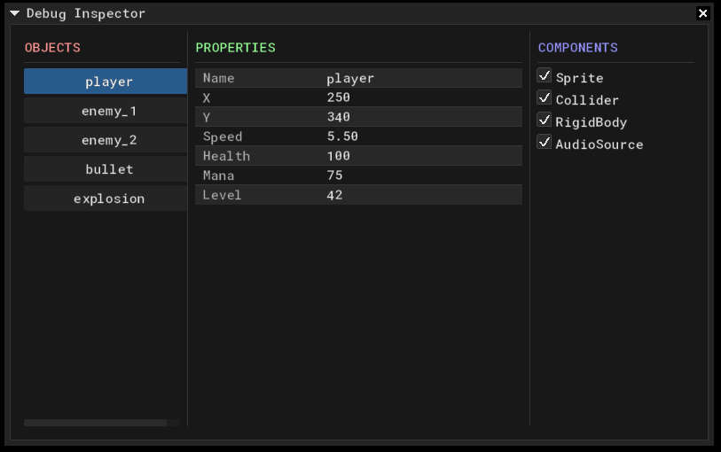</td>
    <td align="center">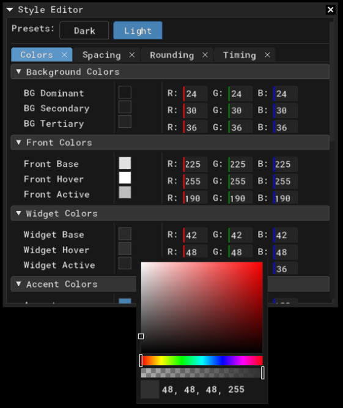</td>
  </tr>
</table>

---

## Documentation

- **[Getting Started](GettingStarted.md)**
- **[API Reference](ApiReference.md)**
